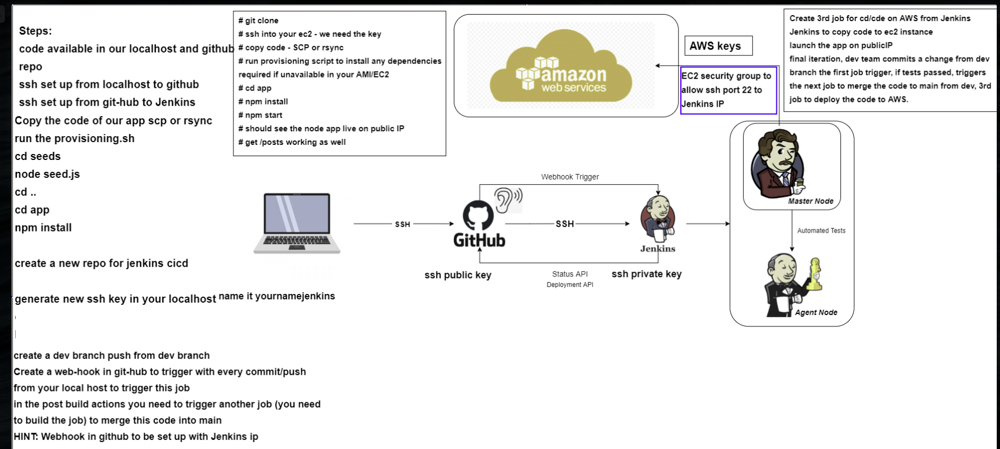
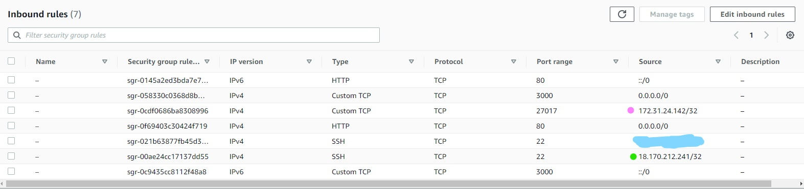
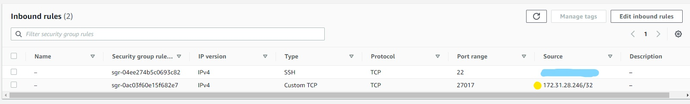
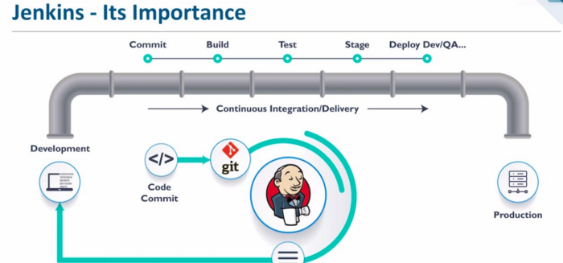

# Building a Continuous Integration and Continuous Delivery/Deployment (CICD) Pipeline

## CI/CD or CI/CDE
### CI — Continuous Integration
- Developer merge and commit to main branch frequently, rather than just at the end and all at once
- Continuously tests code
- Automated testing

### CD — Continuous Delivery
- Extension of continuous integration
- Automated release process
- Deployment is completed manually

### CDE - Continuous Deploymentt
- Only a failed test will prevent a change being release to your customers automatically
- Deployment is completed automatically

### CD vs CDE
- CD - Deployment is completed manually
- CDE - Deployment is completed automatically

### Jenkins
- Jenkins is an open-source automation server
- CI/CD tool
- Supports building, deploying and automating software development projects



Task:
For deployment job in Jenkins
In the execute shell of CD job
- we need to by pass the key asking stage with below command:
ssh -A -o "StrictHostKeyChecking=no" ubuntu@ec2-ip << EOF	

- create an env to connect to db
- navigate to app folder
- kill any existing pm2 process just in case
- launch the app

## Create the EC2 instances for the app and the db in AWS
- See documentation for AWS Two Tier Architecture [here](https://github.com/sachadorf1/cloud_computing_AWS)
- Use default VPC
- Security Groups
    - app:
        - Port 3000: Anywhere
        - HTTP (80): Anywhere
        - Port 27017: 'Db Private IP' (pink)
        - SSH (22): 'My IP' (blue)
        - SSH (22): 'Jenkins IP' (green)


    - db
        - SSH (22): 'My IP' (blue)
        - Port 27017: 'App private IP' (yellow)


## Setting up an SSH Key between GitHub and Jenkins
### Step 1: Create a new key
- Go into .ssh directory: `cd .ssh`
- Create the new key: `ssh-keygen -t rsa -b 4096 -C "<'github email address'>"`
- Enter file in which to save the key: Create a name for your key e.g. sre_jenkins
### Step 2: Add new key to Github repo
- On Github: Go into your repo
- Go into settings
- Select `Deploy Keys`
- Select `Add deploy key`
- Title: e.g. sre_jenkins
- Key: Copy the new public ssh key (in git bash, `cd .ssh` -> `cat sre_jenkins.pem` -> Copy contents)
- Click `Add key`

## Create a webhook in Github repo
- On Github: Go into your repo
- Go into settings
- Select `Webhooks`
- Select `Add webhook`
- Payload URL: http://<'Jenkins_IP'>:8080/github-webhook/
- Which events would you like to trigger this webhook?: `Send me everything`
- Tick `Active`
- Click `Add webhook`

## CICD on Jenkins



### Step 1: CI Job - Testing changes in Dev branch
- In Jenkins:
- Create a new item
- Select `Freestyle Project` ->
#### General:
- Description: Building a CI job with Github and local host
- Tick `Discard old builds`
- Set `Max # of builds to keep` as '3'
- Tick `Github project`
- Project URL <'your github url'>
#### Office 365 Connector:
- Tick `Restrict where this project can be run`
- Label Expression `sparta-ubuntu-node`
#### Source Code Management:
- Select Git
    - In Repositories:
        - Repository URL 'your repo URL'
        - Credentials: Add SSH key:
            - Add -> Jenkins -> Kind: 'SSH Username with private key' -> Give a description and Username -> Private key: `Enter directly` -> Enter contents of private key file (from git bash, in .ssh folder `cat <'private key file'>`) ->
    - In Branches to build:
        - Branch Specifier (blank for 'any'): */dev
#### Build Triggers:
- Tick `GitHub hook trigger for GITScm polling`
#### Build Environment:
- Tick `Provide Node & npm bin/ folder to PATH`
#### Build:
-  Execute Shell:
    - Commands:
```
cd app
npm install
npm test
```
#### Post-build Actions:
- `Add post-build action` -> `Build other projects`
- Projects to build	<'name'>_merge
- Select `Trigger only if build is stable`

- Apply and Save

### Step 2: Merge - Merging Dev into Main branch
#### General:
- Description: 'Merge dev with main branch'
- Tick `Discard old builds`
- Set `Max # of builds to keep` as '3'
- Tick `Github project`
- Project URL 'your github url'
#### Office 365 Connector:
- N/A
#### Source Code Management:
 - Select Git (select key as in previous)    - Additional Behaviours -> Add -> `Merge before build`
 - Enter the following:


#### Build Triggers: (as in step 1)
- Tick `GitHub hook trigger for GITScm polling`
#### Build Environment: (as in step 1)
- Tick `Provide Node & npm bin/ folder to PATH`
#### Build
- N/A
#### Post-build Actions
- `Add post-build action` -> `Build other projects`
- Projects to build	<'name'>_app_deployment
- Select `Trigger only if build is stable`
- `Add post-build action` -> `Build other projects` -> `Git publisher`
- Tick `Push Only If Build Succeeds` and `Merge Results`

- Apply and Save 

### Step 3: Deploy App - Deploys app with new changes
#### General
- Description: 'Deploys EC2 Instance app with code from Github Repo'
- Tick `Discard old builds`
- Set `Max # of builds to keep` as '3'
- Tick `Github project`
- Project URL <'your github repo url'>
#### Office 365 Connector:
- Tick `Restrict where this project can be run`
#### Source Code Management:
- Select Git
    - In Repositories: (as in step 1)
    - In Branches to build:
        - Branch Specifier (blank for 'any'): */main
#### Build Triggers:
- N/A
#### Build Environment:
- Tick `SSH Agent`
    - Credentials
        - Select `Specific credentials`
        - Add -> Jenkins -> Select app SSH key (e.g. SRE_sacha_app_ssh_key)
#### Build:
-  Execute Shell:
    - Commands:

```
# we need to by pass the key asking stage with below command:
ssh -A -o "StrictHostKeyChecking=no" ubuntu@ec2-54-216-124-174.eu-west-1.compute.amazonaws.com << EOF
# remove old folder
rm -rf Jenkins_CICD
# Get updated folder from repo
git clone https://github.com/sachadorf1/Jenkins_CICD
# create an env to connect to db
export DB_HOST=172.31.24.142:27017/posts/
# navigate to app folder
cd ~/Jenkins_CICD/app
# launch the app
npm install
node seeds/seed.js
# start app (in background)
nohup node app.js > /dev/null 2>&1 &
# To debug ssh into your ec2 and run the above commands    


EOF
```

- Apply and Save


## In Summary
When we make changes in the dev branch and `git push`, if the changes pass the tests and merges with the main branch successfully, the changes should show when you open the page(s) for your app.
