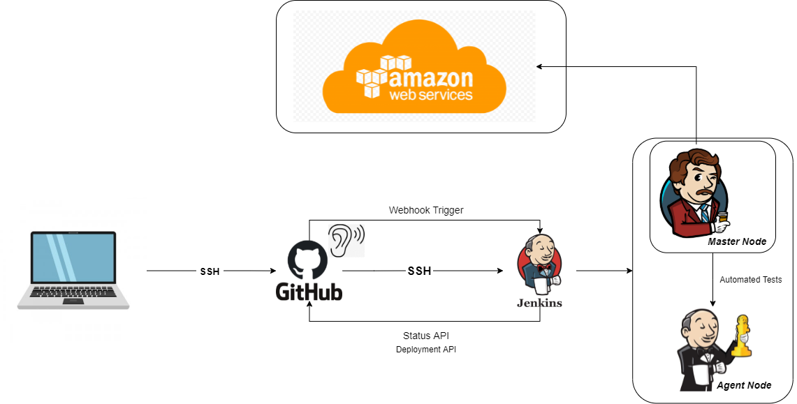

# Change to trigger web-hook
# Made changes in dev branch again
# Another change

# Building a Continuous Integration and Continuous Delivery/Deployment (CICD) Pipeline

For deployment job in Jenkins
In the execute shell of CD job
# we need to by pass the key asking stage with below command:
ssh -A -o "StrictHostKeyChecking=no" ubuntu@ec2-ip << EOF	

# create an env to connect to db
# navigate to app folder
# kill any existing pm2 process just in case
# launch the app